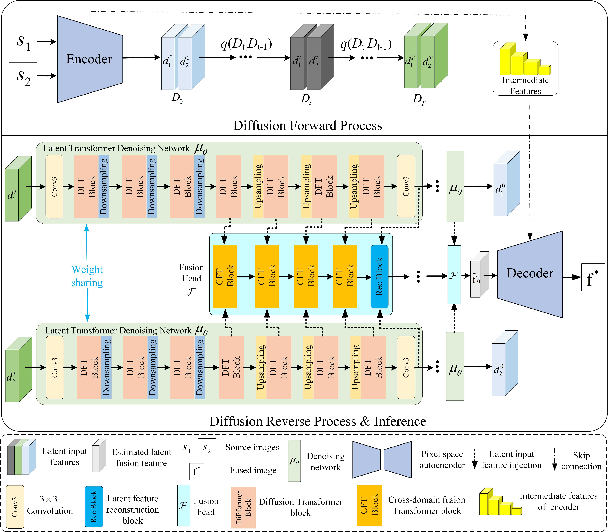
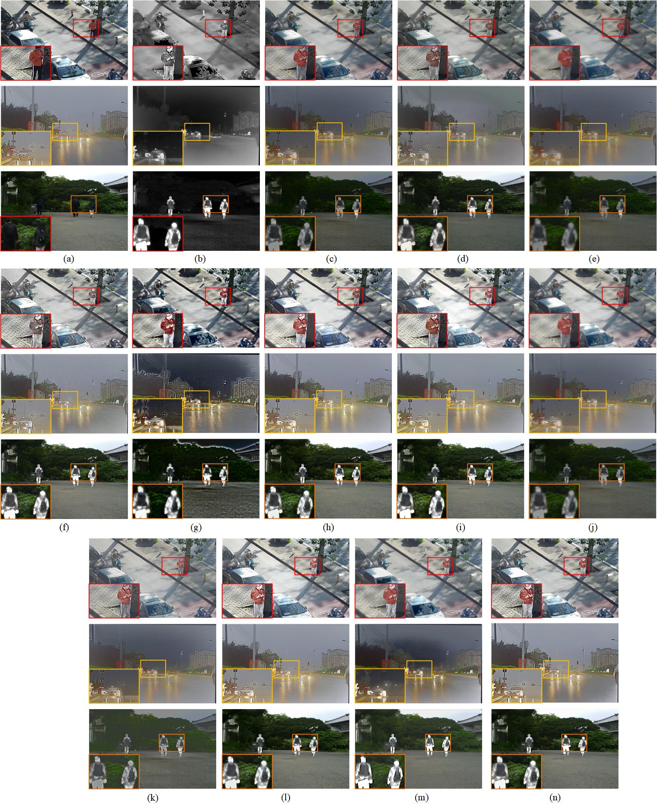
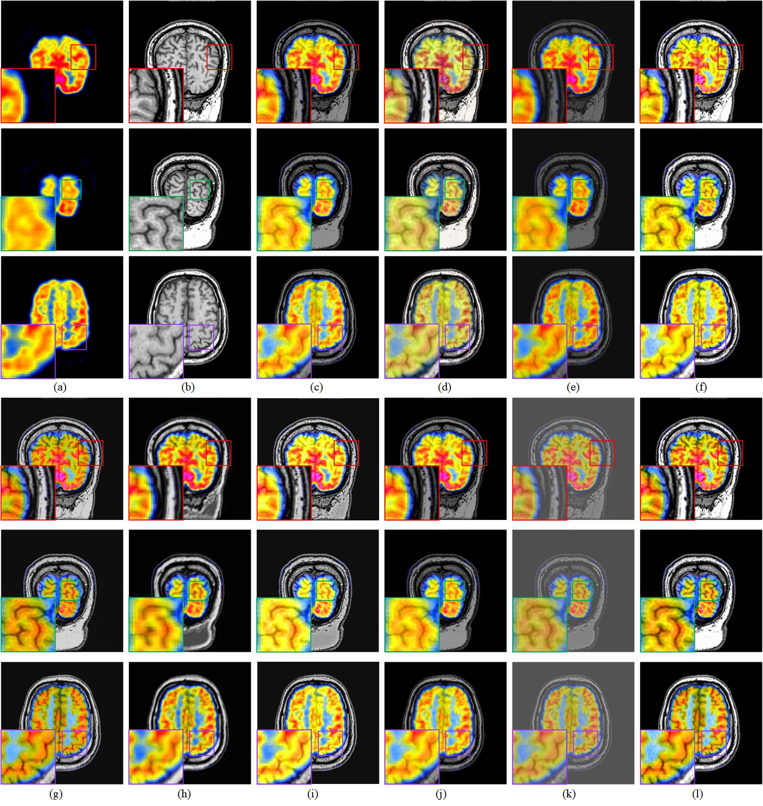

# LFDT-Fusion

The code of "LFDT-Fusion: A Latent Feature-guided Diffusion Transformer Model for General Image Fusion"

## Update
- [2024/6] Release part of code for LFDT-Fusion.
- [2024/8] Release all the code for LFDT-Fusion.


## Abstract
 For image fusion tasks, it is inefficient for the diffusion model to iterate multiple times on the original resolution image for feature mapping. To address this issue, this paper proposes an efficient latent feature-guided diffusion model for general image fusion. The model consists of a pixel space autoencoder and a compact Transformer-based diffusion network. Specifically, the pixel space autoencoder is a novel UNet-based latent diffusion strategy that compresses inputs into a low-resolution latent space through downsampling. Simultaneously, skip connections transfer multi-scale intermediate features from the encoder to the decoder for decoding, preserving the high-resolution information of the original input. Compared to the existing VAE-GAN-based latent diffusion strategy, the proposed UNet-based strategy is significantly more stable and generates highly detailed images without depending on adversarial optimization. The Transformer-based diffusion network consists of a denoising network and a fusion head. The former captures long-range diffusion dependencies and learns hierarchical diffusion representations, while the latter facilitates diffusion feature interactions to comprehend complex cross-domain information. Moreover, improvements to the diffusion model in noise level, denoising steps, and sampler selection have yielded superior fusion performance across six image fusion tasks. The proposed method illustrates qualitative and quantitative advantages, as evidenced by experimental results in both public datasets and industrial environments.
### Framework
<div style="text-align: center;">
    
</div>
<p> Fig. 1. The overall network architecture of LFDT-Fusion. The proposed network comprises two key components: a pixel space autoencoder based on UNet, compressing the source image into latent representations, and incorporating high-resolution information of the original input during decoding. The other component is a diffusion Transformer module comprising a denoising network and a fusion head. The module injects layered latent features from the denoising networks into the fusion head to facilitate the fusion process.</p>


## Environment

We test the code on PyTorch 1.12.1 + CUDA 11.3.

1. Create a new conda environment
```
conda create -n LFDT-Fusion python=3.9
conda activate LFDT-Fusion
```

2. Install dependencies
```
pip install torch==1.12.1+cu113 torchvision==0.13.1+cu113 torchaudio==0.12.1 --extra-index-url https://download.pytorch.org/whl/cu113

pip install mmcv-full==1.7.0 -f https://download.openmmlab.com/mmcv/dist/cu113/torch1.12.0/index.html

pip install -r requirements.txt
```


## Test
You can directly test our model to generate fused images using the following code (note: the pre-training weights sholud be saved in the './check/' file)

Link:  [checkpoint](https://drive.google.com/drive/folders/1BDhQ7wgpRDpF_4Yv6wqBzfykQHE_Dil8?usp=drive_link)
```
#Visible and infrared image fusion
python test-ir.py

#Visible and near-infrared image fusion
python test-nir.py

# Visible and polarized image fusion
python test-pif.py

#Medical image fusion
python test-med.py

#Multi-exposure image fusion
python test-mef.py

#Multi-focus image fusion
python test-mff.py
```
You can find their corresponding configuration file paths in './config/'.
## Train

### 1. Prepare dataset
The datasets are available for download at the following link. (We greatly appreciate the authors opening these datasets.)

<div align="center">

|  Task  |  dataset Name  |  Link  |
| :----------: | :----------: | :-----: |
|         | M3FD   |  https://github.com/JinyuanLiu-CV/TarDAL  |
|  VI-IR  | MSRS   |  https://github.com/Linfeng-Tang/MSRS  |
|         | LLVIP  |  https://github.com/bupt-ai-cz/LLVIP |
|  VI-NIR |  RGB-NIR Scene   |  https://www.epfl.ch/labs/ivrl/research/downloads/rgb-nir-scene-dataset/  |
|   |  MCubeS  |   https://github.com/kyotovision-public/multimodal-material-segmentation |
|  MED    |  Harvard  |  https://www.med.harvard.edu/AANLIB/home.html  |
|  VI-PIF    | Polarization Image  |  http://www.ok.sc.e.titech.ac.jp/res/PolarDem/index.html  |
|       | RSP  |  https://github.com/donyakh/polar-densification/tree/master  |
|  MEF  |  SICE  |  https://github.com/csjcai/SICE |
|       |   MEFB |  https://github.com/xingchenzhang/MEFB |
|  MFF  |  RealMFF  | https://github.com/Zancelot/Real-MFF  |
|       | MFI-WHU   |  https://github.com/HaoZhang1018/MFI-WHU  |
</div>


The data should organized in the following format:
```
train
├── VI-IR                                      ├── VI-NIR
│   ├──ir                                      │   ├──NIR
│   │   ├──0000.png                            │   │   ├──0000.png
...                                            ...
│   ├──vi                                      │   ├──VI
│   │   ├──0000.png                            │   │   ├──0000.png
...                                            ...


├── Med                                        ├── PIF
│   ├──SPECT                                   │   ├──DoLP
│   │   ├──0000.png                            │   │   ├──0000.png
...                                            ...
│   ├──MRI                                     │   ├──S0
│   │   ├──0000.png                            │   │   ├──0000.png
...                                            ...


├── MEF                                        ├── MFF
│   ├──over                                    │   ├──source_1
│   │   ├──0000.png                            │   │   ├──0000.png
...                                            ...
│   ├──under                                   │   ├──source_2
│   │   ├──0000.png                            │   │   ├──0000.png
...                                            ...
```
### 2. Start training
You can use the following code to train the LFDT-Fusion model for different fusion tasks.
```
python -m torch.distributed.launch  --nproc_per_node=8 train.py --sample_selected ddp-solver++ --model_selected DFT --batch_size 4 --fusion_task VI-IR --strategy MAX
```
* nproc_per_node: This parameter represents the number of GPU. （Note: If you want to change nproc_per_node, the device number of "gpu_ids" in the configuration file './config/train.json' needs to be changed as well. For example, if nproc_per_node=2, gpu_ids=[0,1].）

* sample_selected： This parameter represents the selection of the diffusion sampler. There are nine diffusion samplers to choose from: "DDIM, ddp-solver, ddp-solver++, Deis, Unipc, Heun, Euler". The default value is ddp-solver++. Here ddp-solver++ is DPM-Solver++.

* model_selected: This parameter represents a denoising network, which defaults to a Diffusion Transformer network (DFT).

* batch_size: This parameter represents the batch size.

* fusion_task: This parameter represents the selection of the fusion task. There are seven options: "MEF, VI-IR, VI-NIR, PIF, MFF, SPECT-MRI, PET-MRI". 

* strategy: This parameter represents the fusion strategy. There are two options: "MAX, MEAN". 

If you want to train six fusion tasks at once, you can also run the following code:

```
python sample_all.py
```

## Fusion examples
### 1. VI-IR imaging
<div style="text-align: center;">
    
</div>
<p> Fig. 2.   Qualitative comparisons among various fusion methods for VI-IR fusion task. (a) VI image. (b) IR image. (c) DDFM. (d) DeFusion. (e) DIFNet. (f) DiF-fusion. (g) MUFusion. (h) SwinFusion. (i) CDDFuse. (j) TUFusion [37]. (k) U2Fusion. (l) SeAFusion. (m) TarDAL. (n) Ours. (The lower left corner is a closeup view of the different color boxes.).</p>

### 2. Medical imaging
<div style="text-align: center;">
    
</div>
<p> Fig. 3.  Qualitative comparisons among various fusion methods for Med (PET-MRI) fusion task. (a) SPECT image. (b) MRI image. (c) DDFM. (d) DeFusion. (e) DIFNet. (f) CDDFuse. (g) MATR. (h) MUFusion. (i) SwinFusion. (j) TUFusion. (k) U2Fusion. (l) Ours. (The lower left corner is a closeup view of the different color boxes.).</p>

* See the article for more examples
## Citation
```
@article{
    author    = {Bo Yang, Zhaohui Jiang, Dong Pan, Haoyang Yu, Gui Gui, Weihua Gui},
    title     = {LFDT-Fusion: A Latent Feature-guided Diffusion Transformer Model for General Image Fusion},
    booktitle = {Infornation Fusion},
    year      = {2024},
    pages     = {102639},
    doi       = {doi.org/10.1016/j.inffus.2024.102639},
}
```
